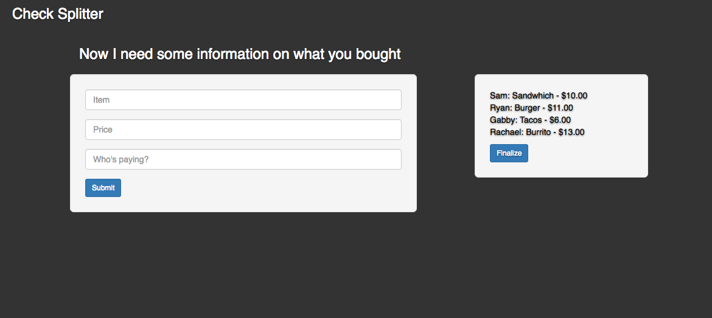

# CheckSplitter

Check Splitter was my first experimental Rails application inspired by my experience working as a server. The application uses Ruby on Rails MVC framework.

## Welcome Page

The index page welcomes uses and brings them to the `checks/new` page.

## New Checks

The checks table requires some basic information about the check that the user inputs to successfully create a new check.

## New Check Items

Items are nested under the check route so each item can be associated to the correct check. Items are added by the user as well as their price and the person who bought that item. Once all items are inputed, the user can finalize that check, bringing the user to the `check/show` page.

## Check Show Page

Finally, the user reaches the check show page, where the user can see the split check and each person's total contribution to the bill.

